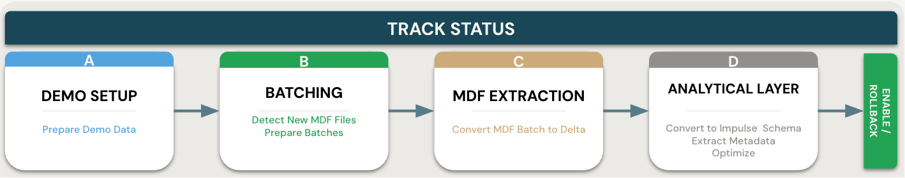
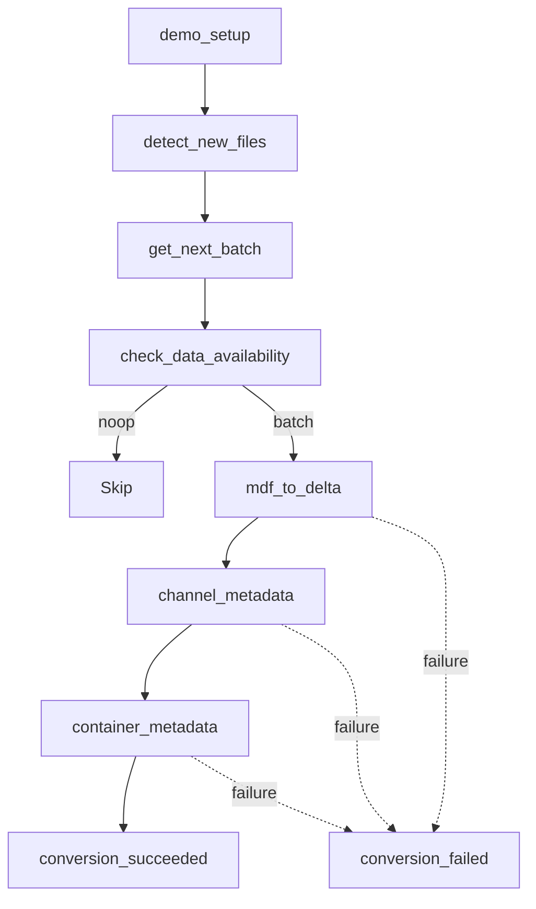
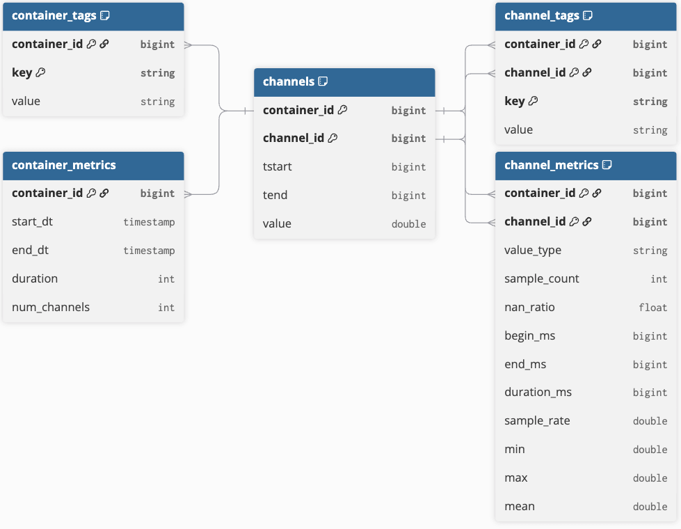

# Solution Accelerator for converting ASAM MDF files to Delta

[](https://databricks.com)
[](https://docs.databricks.com/en/data-governance/unity-catalog/index.html)
[](https://docs.databricks.com/en/compute/serverless.html)

Convert ASAM MDF4 files to Delta and build a compact silver analytics layer using the **[databricks-impulse](https://github.com/databrickslabs/impulse)** (`impulse_data_sources.mdf`) Spark data sources.


## Process overview



This accelerator demonstrates a pattern to:

- Detect new MDF4 files arriving in a Unity Catalog Volume (Auto Loader)
- Track per-file processing state in a centralized `status` Delta table
- Ingest MDF4 via `mdf_signals` (RLE), `mdf_metadata`, and optional `mdf_masters`
- Write silver intervals directly to `channels` (no separate analytical-layer step)
- Build channel metadata, then container metadata, after ingest
- Mark workflow runs as succeeded/failed and compact data for query performance

## Job workflow

The Databricks job runs as a linear setup and batch-selection phase, then ingests MDF4 files when data is available. Channel and container metadata run sequentially after ingest; a final status task marks the run succeeded or rolls back on failure.



See [`docs/architecture.md`](docs/architecture.md) and [`docs/workflow_diagram.mmd`](docs/workflow_diagram.mmd) for details.

## Compute

| Environment | Compute |
|-------------|---------|
| **dev** | Serverless (`dev_env`; env v4 / Python 3.12; `asammdf` for demo setup) |
| **prod** | Job cluster (`ingest_cluster`; DBR 16.4 LTS / Python 3.12) |

**databricks-impulse** is installed at runtime by `c_mdf_to_delta.py` via a `%pip install`
directly from the GitHub repo (it is not yet on PyPI), currently pinned to the
`feature/mdfDataSources` branch. It requires **Python 3.12** (`>=3.12,<3.13`). To switch to
the released package after merge, change the git ref in that notebook to `@main`. See
[`docs/deployment.md`](docs/deployment.md).

Custom Spark data sources registered at runtime:

- `mdf_signals` — RLE-encoded intervals → `channels`
- `mdf_metadata` — per-channel metadata → `bronze_meta`
- `mdf_masters` — master time base → `masters` (optional)

## Repository layout

- `notebooks/ingest_mdf/` — ingest job notebooks (`MDA_Demo`)
- `notebooks/reports/` — reporting job notebook `signal_report.py` (`MDA_Report`)
- `modules/utils/` — shared helpers (`delta_ops`, `notebook_helpers`, `demo_conversion`, …)
- `resources/ingest_job.yml` — ingest job (`MDA_Demo`) bundle definition
- `resources/report_job.yml` — report job (`MDA_Report`) + `MDF4 Signal Report` dashboard resource
- `dashboards/` — Lakeview dashboard (`MDF_Report`)
- `examples/` — OBD demo archive and sample queries ([`examples/README.md`](examples/README.md))
- `docs/` — architecture, data model, deployment, parameters, troubleshooting

## Demo data

The bundled OBD CSV archive (`examples/obd_dataset.zip`) is converted to MDF4 by `a_demo_setup.py`:

Weber, Marc (2023): *Automotive OBD-II Dataset*. Karlsruhe Institute of Technology. DOI: [10.35097/1130](https://doi.org/10.35097/1130)

## Data model



Full table reference: [`docs/data-model.md`](docs/data-model.md).

Ingest output tables (`MDA_Demo`): `status`, `channels`, `bronze_meta`, `masters` (optional), `channel_tags`, `channel_metrics`, `container_tags`, `container_metrics`.

The `MDA_Report` job additionally builds a Gold-layer star schema (`report_*` tables) — see [`docs/data-model.md`](docs/data-model.md).

## Running with Databricks Bundles

```bash
databricks bundle validate -e dev
databricks bundle deploy -e dev
databricks bundle run -e dev MDA_Demo
```

First demo run with a clean schema:

```bash
databricks bundle run -e dev MDA_Demo --params reset=True
```

> **⚠️ `reset=True` is destructive.** In demo mode (`use_demo_data=True`) it runs
> `DROP SCHEMA IF EXISTS <catalog>.<schema> CASCADE` and recreates empty tables — this deletes
> everything in the target schema. It is ignored in live mode (`use_demo_data=False`, the prod
> default). Always point `catalog`/`schema` at a dedicated demo namespace.

## Jobs: ingest, then report

`databricks bundle deploy` creates **two independent jobs** plus a dashboard:

| Resource | Type | Purpose |
|----------|------|---------|
| `MDA_Demo` | Job | **Ingest** — detect MDF4 files and convert them to the silver tables (`channels`, `bronze_meta`, `channel_metrics`, `container_metrics`, …). **Run this first.** |
| `MDA_Report` | Job | **Report** — builds a Gold-layer star schema from the ingested tables with the impulse reporting framework (RPM/speed histograms, RPM-vs-speed heatmap, per-drive stats, 10 km milestones). Run **after** ingest. |
| `MDF4 Signal Report` | Dashboard | AI/BI dashboard visualizing the silver metrics **and** the report's Gold tables. Deployed with `MDA_Report`. |

### Typical workflow

```bash
# 1. Deploy both jobs + the dashboard
databricks bundle deploy -e dev

# 2. Ingest first (clean reset on the first run) — populates the silver tables
databricks bundle run -e dev MDA_Demo --params reset=True

# 3. Then run the report — computes the Gold star schema the dashboard reads
databricks bundle run -e dev MDA_Report
```

4. **View the dashboard:** open **MDF4 Signal Report** from the workspace *Dashboards* list (or grab its
   URL with `databricks bundle summary -e dev`). Its "Report Results" page only has data once
   `MDA_Report` has run; the "Signal Report" page works as soon as ingest completes.

`MDA_Report` is fully independent — you can re-run it any time after ingest without touching `MDA_Demo`.

### Warehouse for the dashboard

The dashboard needs a SQL warehouse, resolved **by name** via the `warehouse_name` variable
(default `"Shared Unity Catalog Serverless"`). Because the whole bundle — including the dashboard —
is validated on every command, this warehouse must resolve for **any** `deploy`/`run` (even
`MDA_Demo`). If your workspace uses a different warehouse, override the name:

```bash
databricks bundle deploy -e dev --var=warehouse_name="<your warehouse>"
databricks bundle run    -e dev MDA_Report --var=warehouse_name="<your warehouse>"
```

> **Note:** the dashboard's dataset queries reference `mda_demo.default.*` directly — bundle
> `${var.*}` placeholders are **not** substituted inside `.lvdash.json`. If you deploy to a
> different catalog/schema, edit the table names in `dashboards/MDF_Report.lvdash.json`. The
> `signal_report` notebook itself is parameterized via `catalog`/`schema` widgets.

## Parameters

See [`docs/parameters.md`](docs/parameters.md) for the full widget reference. Key job parameters:

- **catalog / schema** — Unity Catalog location
- **write_masters** — optional `masters` table
- **partitioning**, **target_partition_mb**, **stripe_target_mb**, **max_groups_per_partition** — `mdf_signals` tuning
- **reprocess_current_run / reprocess_last_failed_run** — batch selection behavior

When `next_run_id` is `noop`, the `check_data_availability` condition skips ingest.

## Sample queries

```sql
SELECT status, COUNT(*)
FROM <catalog>.<schema>.status
GROUP BY status;
```

```sql
SELECT container_id, channel_id, tstart, tend, value
FROM <catalog>.<schema>.channels
WHERE container_id = 1 AND channel_id = 1
ORDER BY tstart
LIMIT 1000;
```

More examples in [`examples/`](examples/).

## Troubleshooting

See [`docs/troubleshooting.md`](docs/troubleshooting.md).

## License

This project is licensed under the [Databricks License](LICENSE.md). It is a Databricks Solution Accelerator — not an OSI-approved open-source license. Use is subject to the MCSA scope in the license file.

## Contributing

See [CONTRIBUTING.md](CONTRIBUTING.md).

## Authors

- Thomas Bonfert <thomas.bonfert@databricks.com>
- Jonathan Bräuer <jonathan.braeuer@databricks.com>

## 📄 Third-Party Package Licenses

&copy; 2025 Databricks, Inc. All rights reserved. The source in this project is provided subject to the Databricks License [https://databricks.com/db-license-source]. All included or referenced third party libraries are subject to the licenses set forth below.

| Package | License | Copyright |
|---------|---------|-----------|
| databricks-impulse | Databricks License | © Databricks, Inc. |
| asammdf | LGPL v3+ | © Daniel Hrisca and asammdf contributors |
| lz4 | BSD 3-Clause | © Jonathan Underwood and contributors |
| nptyping | MIT | © Ramon Hagenaars |
| pandas | BSD 3-Clause | © pandas development team / NumFOCUS |
| pyspark | Apache License 2.0 | © The Apache Software Foundation |
| delta-spark | Apache License 2.0 | © Delta Lake authors / The Linux Foundation |
| databricks-sdk | Apache License 2.0 | © Databricks, Inc. |
| pytest | MIT | © Holger Krekel and pytest contributors |
| ruff | MIT | © Astral Software Inc. |
