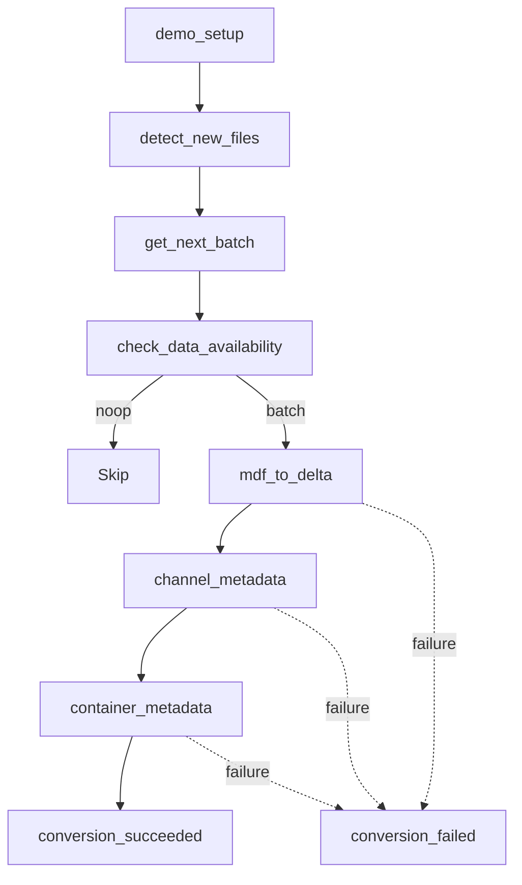

# Architecture

The bundle defines **two independent jobs**: **`MDA_Demo`** (ingest) and **`MDA_Report`** (reporting),
plus the **MDF4 Signal Report** dashboard. Run ingest first, then the report.

The **MDF4 Ingest** job (`MDA_Demo`) is a Databricks workflow that discovers MDF4 files in a Unity Catalog volume, tracks processing state in a `status` table, ingests signal and metadata via the **databricks-impulse** (`impulse_data_sources.mdf`) Spark data sources, builds channel/container analytics tables, and finalizes each run as succeeded or failed.

## Job workflow

The Databricks job runs as a linear setup and batch-selection phase, then ingests MDF4 files when data is available. Channel and container metadata run sequentially after ingest; a final status task marks the run succeeded or rolls back on failure.

A styled variant with task descriptions lives in [`workflow_diagram.mmd`](workflow_diagram.mmd).

## Compute model

| Target | Compute |
|--------|---------|
| **dev** | Serverless for all tasks (`dev_env`; env v4 / Python 3.12; `asammdf` for demo) |
| **prod** | Job cluster for all ingest tasks (`ingest_cluster`; DBR 16.4 LTS / Python 3.12) |

**databricks-impulse** is `%pip`-installed from GitHub at runtime by `c_mdf_to_delta.py` (not yet on PyPI); it requires Python 3.12. The ingest compute needs outbound access to GitHub.

## Data flow

1. **Discovery** — Auto Loader appends `unprocessed` rows to `status` with a stable `run_id` per micro-batch.
2. **Batch selection** — `get_next_batch` picks the next `run_id` and marks it `in_progress`.
3. **Ingest** — `mdf_signals` (RLE) → `channels`; `mdf_metadata` → `bronze_meta`; optional `mdf_masters` → `masters`.
4. **Metadata** — Channel and container tags/metrics derived from `channels` and `bronze_meta`.
5. **Finalize** — Success path runs `OPTIMIZE`; failure path deletes partial rows and marks `failed`.

The workflow diagram above covers the ingest job; the report job runs separately, after ingest.

## Reporting pipeline (`MDA_Report`)

A separate serverless job (`notebooks/reports/signal_report.py`) that runs **after** ingest. It uses
the **databricks-impulse** reporting framework (`impulse_reporting` / `impulse_query_engine`) to select
channels by metadata tags, define events (RPM band, per-container, 10 km distance/milestones), and
compute duration-weighted histograms, a 2D RPM-vs-speed heatmap, per-event statistics, and milestone
values. Results are persisted as a Gold-layer star schema (`report_*` tables) and surfaced in the
**MDF4 Signal Report** dashboard (`dashboards/MDF_Report.lvdash.json`), which also visualizes the silver
metrics. See [`data-model.md`](data-model.md) (Gold layer) and [`deployment.md`](deployment.md).

See [`data-model.md`](data-model.md) for table schemas.
